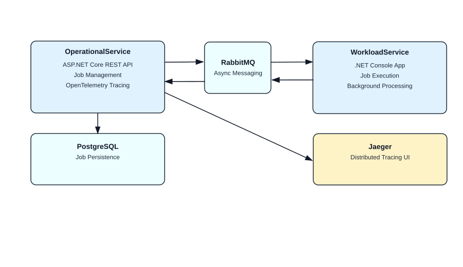
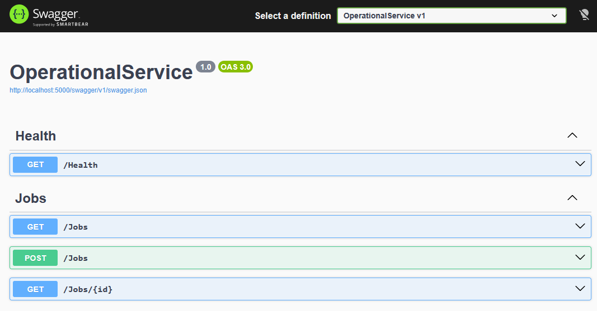
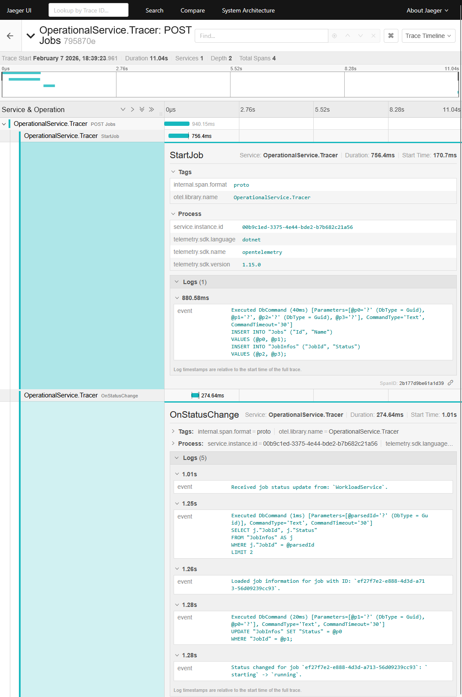

# Service to Service - DotNETC Core 10

The goal of this project is to demonstrate my approach to backend service design, containerization, inter-service communication, observability, and database management using modern .NET and cloud-native patterns.

---

## Table of Contents

1. [Project Overview](#project-overview)

   * [Services](#services)
   * [Communication & Observability](#communication--observability)
2. [Architecture Highlights](#architecture-highlights)
3. [Architecture Diagram](#architecture-diagram)
4. [Starting the Services](#starting-the-services)

   * [Prerequisites](#prerequisites)
   * [Step 1: Start the infrastructure and services](#step-1-start-the-infrastructure-and-services)
   * [Step 2: Initialize the database](#step-2-initialize-the-database)
5. [Trace Visualization](#trace-visualization)
6. [API Usage Examples](#api-usage-examples)

   * [Create a New Job](#create-a-new-job)
   * [Get All Jobs](#get-all-jobs)
7. [Swagger UI](#swagger-ui)
8. [Jaeger UI](#jaeger-ui)

---

## Project Overview

The solution is composed of **two independent services** that work together to manage and execute jobs in an asynchronous, event-driven manner.

### Services

#### 1. OperationalService

* A RESTful API built with ASP.NET Core.
* Responsible for managing Jobs (creation, persistence, and orchestration).
* Persists job data in a **PostgreSQL** database using **Entity Framework Core**.
* Publishes messages to **RabbitMQ** to trigger job execution workflows.
* Fully instrumented with **OpenTelemetry** for distributed tracing.

#### 2. WorkloadService

* A .NET Console application.
* Subscribes to RabbitMQ messages produced by the OperationalService.
* Executes registered Jobs asynchronously based on received messages.
* Designed to simulate background or batch-style workloads.

### Communication & Observability

* **RabbitMQ** is used as the messaging backbone to decouple the services and enable asynchronous processing.
* **OpenTelemetry** is used to trace all operations within the OperationalService.
* Traces are exported to **Jaeger**, where they can be visualized through the Jaeger UI for debugging and performance analysis.

---

## Architecture Highlights

* Microservice-style separation of concerns
* Asynchronous, message-driven communication
* Containerized services using Docker and Docker Compose
* Runtime-safe database migrations
* End-to-end observability via distributed tracing

---

## Architecture Diagram



---

## Starting the Services

### Prerequisites

* Docker
* Docker Compose
* .NET SDK (for running EF Core migrations locally)

---

### Step 1: Start the infrastructure and services

From the project root directory, run:

```commandline
docker compose up --build -d
```

This will start:

* PostgreSQL
* RabbitMQ
* OperationalService
* WorkloadService
* Jaeger

---

### Step 2: Initialize the database

The database schema is managed using **Entity Framework Core migrations**.

#### 1. Install EF Core CLI (if not already installed)

```commandline
dotnet tool install --global dotnet-ef
```

#### 2. Apply the latest migration

```commandline
dotnet ef database update --project src/Database/Database.csproj --connection "User ID=user;Password=pass;Host=localhost;Port=5432;Database=db;"
```

This will create and initialize the PostgreSQL schema required by the OperationalService.

---

## Trace Visualization

Once the services are running, you can access the **Jaeger UI** to inspect distributed traces generated by the OperationalService. This allows you to follow request lifecycles, database interactions, and message-publishing operations end-to-end.

## API Usage Examples

The `OperationalService` exposes a REST API for managing Jobs. Below are example requests using `curl` that demonstrate how to interact with the service once it is running.

---

### Create a New Job

This endpoint creates a new Job and persists it to the database. Once created, the Job will be published to RabbitMQ for asynchronous processing by the `WorkloadService`.

```bash
curl -X POST http://localhost:5000/jobs \
  -H "Content-Type: application/json" \
  -d '{
    "name": "My 1st Job"
  }'
```

**Example request payload:**

```json
{
  "name": "My 1st Job"
}
```

---

### Get All Jobs

This endpoint retrieves a paginated list of all Jobs currently stored in the system.

```bash
curl http://localhost:5000/jobs
```

**Example response:**

```json
{
  "data": [
    {
      "id": "d48e6d8c-ca8d-41f5-96f0-90f5610fe757",
      "name": "My 1st Job",
      "status": "complete"
    }
  ],
  "pagination": {
    "pageNumber": 1,
    "pageSize": 10,
    "totalCount": 1
  }
}
```

---

## Swagger UI

The REST API is documented using Swagger and can be explored interactively via the Swagger UI:

**[http://localhost:5000/swagger/](http://localhost:5000/swagger/)**

The Swagger UI provides a convenient way to inspect available endpoints, request/response models, and to execute requests directly from the browser.



---

## Jaeger UI

All distributed traces emitted by the `OperationalService` are exported using OpenTelemetry and can be visualized using Jaeger:

**[http://localhost:16686/](http://localhost:16686/)**

The Jaeger UI allows you to inspect request lifecycles end-to-end, including database interactions and asynchronous messaging flows between services.


